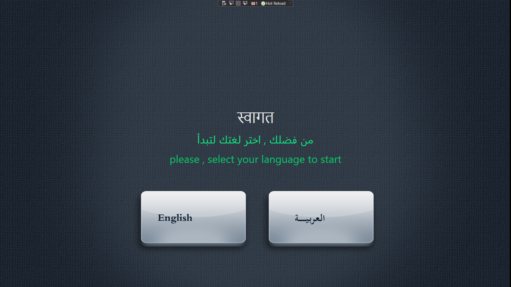
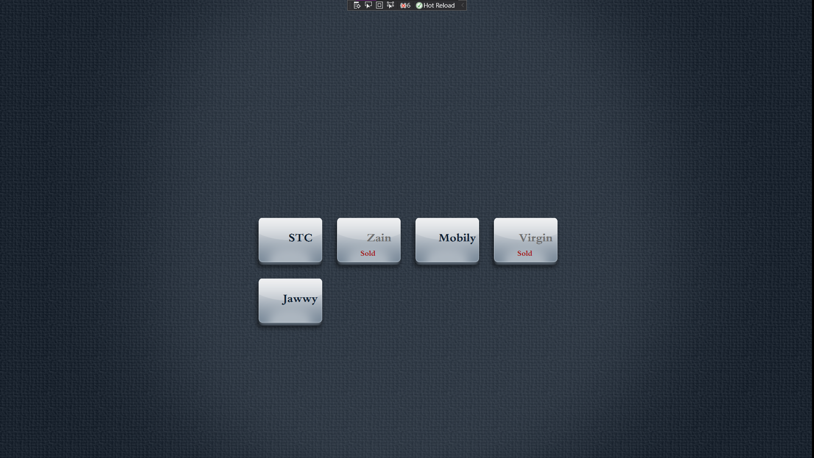
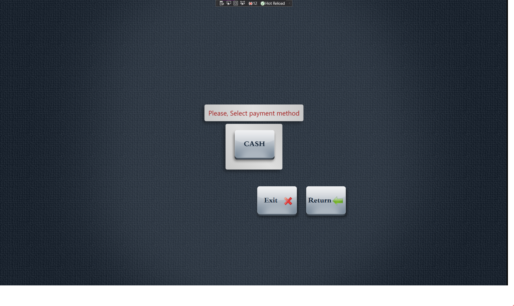
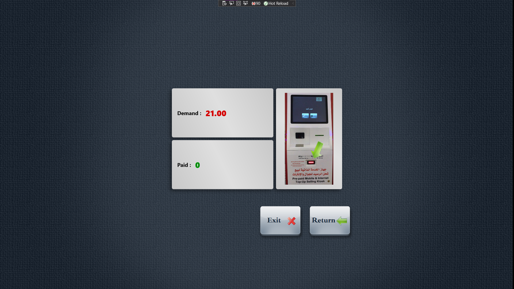
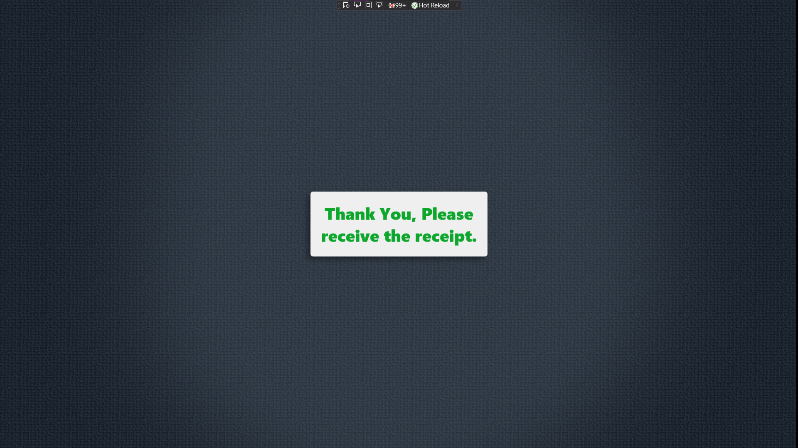

# Geeky POSK

Self Service Kiosk allows users to select service and pay for it using cash bills

### Modules ####

* Server (WCF windows service)
* Client App (WPF)
* Dashboard & Admin (WPF)


### How to use ####

* Restore Nuget pacakges and build the solution
* Update connection string in all the three modules
* To simulate and demo the application, you can generate demo data by running the following test

```cs
GenerateValidData()
```






